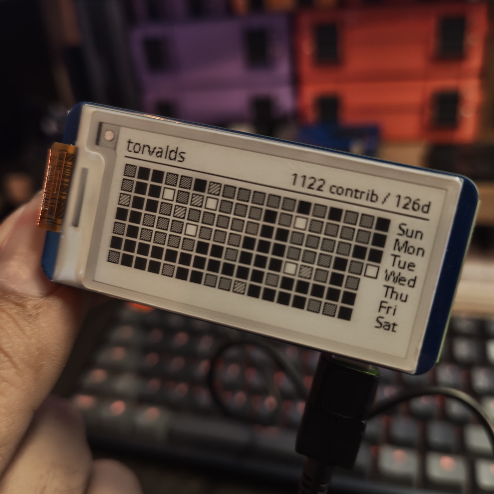

# GitEtch

*Your GitHub history, etched in e-ink.*

GitEtch renders your **GitHub contributions heatmap** (the familiar grid
of commits) on a **Waveshare 2.13" e-Paper HAT** connected to a
**Raspberry Pi**.

It uses: - Waveshare's Python driver (`waveshare_epd`) - GitHub's
**GraphQL API** to fetch `contributionCalendar` - Pillow (PIL) to draw
the grid and push the frame buffer to the display



------------------------------------------------------------------------

## Hardware

-   Raspberry Pi (works great on Pi Zero 2 W)
-   Waveshare 2.13" e-Paper HAT V4 (SPI)

Vendor documentation:\
https://www.waveshare.com/wiki/2.13inch_e-Paper_HAT_Manual#Working_With_Raspberry_Pi

------------------------------------------------------------------------

## Enable SPI on Raspberry Pi

The display communicates over **SPI**, so it must be enabled:

``` bash
sudo raspi-config
# Interfacing Options -> SPI -> Yes
sudo reboot
```

Verify that SPI devices exist:

``` bash
ls /dev/spi*
```

You should see `/dev/spidev*`.

------------------------------------------------------------------------

## System Packages

On modern Raspberry Pi OS, Python is "externally managed". Prefer `apt`
packages:

``` bash
sudo apt update
sudo apt install -y   python3-pip   python3-pil   python3-numpy   python3-requests   python3-spidev
```

------------------------------------------------------------------------

## Vendor Drivers (not committed)

This project intentionally does **not** include Waveshare's `lib/` and
`pic/` directories.

Fetch them from Waveshare's demo repository and copy only what is
required:

``` bash
git clone https://github.com/waveshareteam/e-Paper.git ~/waveshare-epaper

cp -r ~/waveshare-epaper/RaspberryPi_JetsonNano/python/lib ./lib
cp -r ~/waveshare-epaper/RaspberryPi_JetsonNano/python/pic ./pic
```

Expected layout:

    gitetch/
      github_etch.py
      lib/
        waveshare_epd/
          epd2in13_V4.py
          epdconfig.py
          ...
      pic/
        Font.ttc

------------------------------------------------------------------------

## Configure the Target GitHub User

Inside `github_etch.py` you will find a configuration block like:

``` python
LOGIN = "torvalds"
```

Set `LOGIN` to the GitHub username you want to visualize.

This value controls which account is queried by the GraphQL API and
therefore whose contribution history is rendered on the display.

------------------------------------------------------------------------

## Why GitHub GraphQL

GitHub's REST API does not expose the contribution calendar cleanly.\
The GraphQL API provides structured access via:

    user(login: ...)
      contributionsCollection(from:, to:)
        contributionCalendar
          weeks
            contributionDays { date, contributionCount, weekday }

This is the same data GitHub uses to render the profile heatmap.

------------------------------------------------------------------------

## GitHub Token

The GraphQL endpoint requires authentication via a **Personal Access
Token**.

Create one in:

GitHub → Settings → Developer Settings → Personal Access Tokens

For public data, no special scopes are required.

------------------------------------------------------------------------

## Export the Token

Set it in your shell:

``` bash
export GITHUB_TOKEN="ghp_xxxxxxxxxxxxxxxxxxxxxxxxxxxxx"
```

Verify:

``` bash
echo "$GITHUB_TOKEN"
```

Persist across reboots:

``` bash
echo 'export GITHUB_TOKEN="ghp_xxxxxxxxxxxxxxxxxxxxxxxxxxxxx"' >> ~/.bashrc
source ~/.bashrc
```
------------------------------------------------------------------------

## Run

``` bash
python3 github_etch.py
```

You should see: - The username configured in `LOGIN` - Total
contributions in the last 90 days - A readable, chunked heatmap sized
for 2.13"

------------------------------------------------------------------------

## What the Script Does

-   Computes a time window (`now - DAYS` → `now`)
-   Sends a GraphQL POST to `https://api.github.com/graphql`
-   Receives `contributionCalendar.weeks[].contributionDays[]`
-   Maps `contributionCount` to visual intensity
-   Renders a 7-row grid (Sun--Sat) for recent weeks
-   Pushes the buffer to the e-paper display


## Future Ideas

GitEtch could evolve from a single-user widget into a multi-voice artifact.

Instead of one `LOGIN`, the script could accept a list:

```python
USERS = ["Moztoo", "octocat", "someone_else"]
```

and cycle between them every N minutes or hours. On an e-ink display this feels natural—each update becomes a “page turn”.

GitHub’s GraphQL API also exposes much richer data than the heatmap alone, enabling new modes:

- Total commits in the period
- Current streak (consecutive days)
- Last commit (repo + short message)
- Open / closed PRs
- Most used languages

This would allow GitEtch to rotate between views:
heatmap → stats → last activity → comparison.
